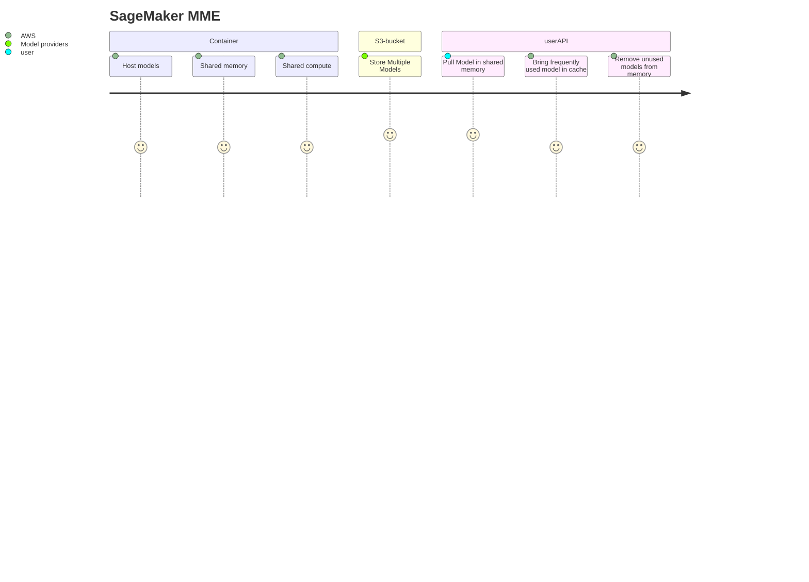

#### This article describes SageMaker Multi Model Endpoint 

```mermaid
journey
   title SageMaker MME
   section Container
      Host models: 4:AWS
      Shared memory: 4:AWS
      Shared compute: 4:AWS
   section S3-bucket
      Store Multiple Models: 5:Model providers
   section userAPI
      Pull Model in shared memory: 5:user
      Bring frequently used model in cache: 4:AWS
      Remove unused models from memory: 4:AWS
```
