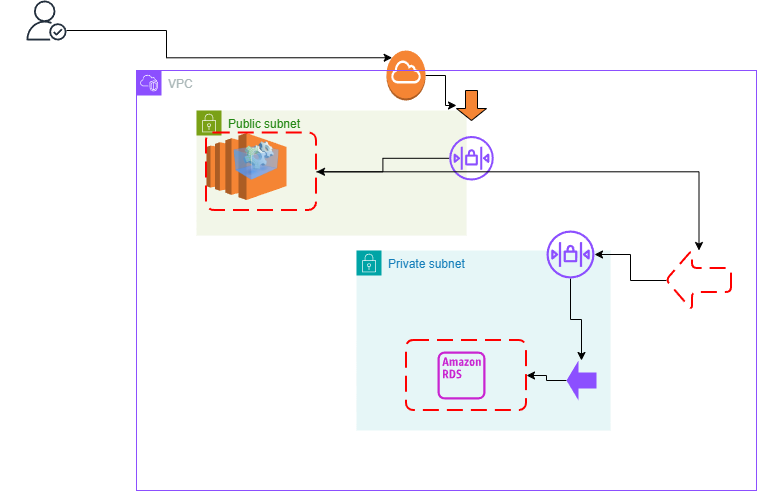

### Scenario
You have a web application that accepts requests from the internet. 
Clients can send requests to query for data. When a request comes in, 
the web application queries a MySQL database and returns 
the data to the client.
### Solution Design

### Description
The user requests are directed through the internet gateway to the application hosted 
in an EC2 in public subnet inside a VPC. The user request will be validates at NACLs 
which determine if the request is a valid request and furthers the request to the 
security groups which determines if the traffic is to be allowed. If allowed, the 
request will reach the to the web application hosted in EC2. This EC2 service in turn
will fetch results from backend RDS My SQL database hosted in private subnet. Here as
well the requests will be validated against the private subnet NACLs and security groups.
If allowed, the result will be fetched and routed in the same path back to the user.
